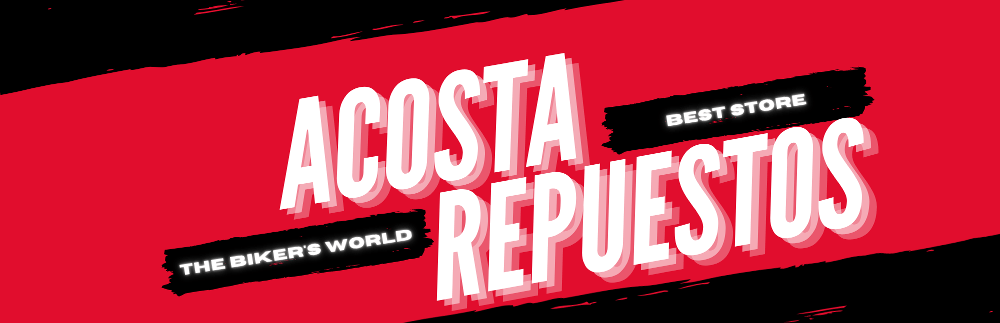

# Acosta Repuestos



# Ir a leer README en español
Idioma español: (haz click ➡)
[](https://github.com/Cristian-Ayala/acosta-repuesto-vite/blob/master/README.es.md)
> YOUR ARE CURRENTLY READING IT IN ENGLISH

## Table of Contents

- [Description](#description-of-the-application)
- [Installation](#installation)
- [Functionalities](#functionalities)
   - [Install App](#install-app)
   - [Open App](#open-app)
   - [SideBar](#sideBar)
   - [Area selection](#area-selection)
   - [Brands](#brands)
   - [Categories](#categories)
   - [Products](#products)
   - [Orders](#orders)
   - [Statistics](#statistics)
   - [Clients](#clients)
- [Contributing](#contributing)

## Description of the application

The application provides a comprehensive platform for managing multiple business aspects, offering a wide range of functionalities and advanced features to optimize business management.

### Product Management

Facilitates complete product management, including the ability to intuitively add, edit and delete products. Users can scan UPC codes (barcodes) using their mobile device's camera or connect a professional scanner for fast and accurate data entry.

### Brand and Category Management

Allows you to create, organize and manage brands and categories for efficient product classification, providing a more robust and easy-to-navigate organizational structure.

### Customer Management

Provides tools to record and manage detailed customer information, including purchase histories, preferences and contact details, enabling a more personalized relationship with customers.

### Order Management

Facilitates comprehensive order tracking from receipt to delivery. Users can manage pending, in-process and completed orders.

### Sales Statistics

Provides in-depth sales analysis and key metrics to evaluate business performance and make informed strategic decisions.

### Inventory Management

Provides precise inventory control, ensuring efficient, real-time inventory management.

### Product segregation by location

Allows detailed and specific management of products across multiple locations, ensuring effective control of product availability and distribution.

The application is equipped with the ability to scan UPC codes using the mobile device's camera or by connecting a professional scanner, providing users with flexibility and efficiency in data entry. This feature adds an additional level of convenience and accuracy to product management, enhancing the user experience and optimizing business processes.

## Installation

Provide step-by-step instructions on how to install or set up your project. Include any prerequisites, dependencies, or environment setup required.

### 1. Clone the GitHub repositories:
   - [Frontend app](https://github.com/Cristian-Ayala/acosta-repuesto-vite/)
   - [NestJS backend](https://github.com/Cristian-Ayala/acosta-rep-backend)

### 2. Configuration Steps:

#### For the Frontend (Vite App):
1. Navigate to the cloned `acosta-repuesto-vite` directory.
2. Create a `.env` file in the root directory if it doesn't exist.
3. Add the following variables to the `.env` file:

```plaintext
# Auth0 Integration
VITE_CLIENT_ID="<YOUR_AUTH0_CLIENT_ID>"
VITE_DOMAIN="<YOUR_AUTH0_DOMAIN>"

# Hasura Integration
VITE_BACKEND_URL="<HASURA_URL>"

# NestJS Integration
VITE_FILE_MANAGER="<NESTJS_BACKEND_URL>/file-manager/"
```

#### Optional: Sentry Integration:
If you want to set up Sentry for error reporting, add these variables to the `.env` file:

```plaintext
# Sentry Variables
VITE_SENTRY_TRACES_SAMPLE_RATE=1.0
VITE_SENTRY_REPLAY_SESSION_SAMPLE_RATE=1.0
VITE_SENTRY_REPLAY_ON_ERROR_SAMPLE_RATE=1.0
VITE_SENTRY_TRACE_PROPAGATION_TARGET="https://yourserver.io/api/"
SENTRY_TELEMETRY=false # Set to true in production
VITE_SENTRY_DSN="NONE"
SENTRY_AUTH_TOKEN="NONE"
SENTRY_ORG="NONE"
SENTRY_PROJECT="NONE"
```

Replace the placeholder values with your actual configuration.

### 3. Running the projects:

#### For the Frontend:
1. Install dependencies: Run `npm install` or `yarn install`.
2. Start the development server: Run `npm run dev` or `yarn dev`.

#### For the NestJS Backend:
1. Navigate to the cloned `acosta-rep-backend` directory.
2. Set up the environment variables required by the NestJS application.
3. Install dependencies: Run `npm install` or `yarn install`.
4. Start the server: Run `npm run start` or `yarn start`.

### Additional Resources:
- [Hasura Documentation for integrating Auth0](https://hasura.io/learn/graphql/hasura/authentication/1-create-auth0-app/)

Please ensure to replace placeholders like `<YOUR_AUTH0_CLIENT_ID>`, `<YOUR_AUTH0_DOMAIN>`, `<HASURA_URL>`, `<NESTJS_BACKEND_URL>` with the actual values obtained from your configurations.

Always refer to the project's documentation and specific README files in the repositories for any additional setup steps or specific instructions not covered here.

## Functionalities

### Install App

#### Instalation from browser
<p align="center">
  
</p>

### Open App

#### Just like another app
<p align="center">
  
</p>

### SideBar

#### Easy Navigation
<p align="center">
  
</p>

### Area selection

#### Change area depending on where you are
(see how the stock from each product changes depending on the area selected)
<p align="center">
  
</p>


### Brands

#### List all brands
<p align="center">
  
</p>

#### Add brand
<p align="center">
  
</p>

#### Filter brands
<p align="center">
  
</p>

#### Edit brands
<p align="center">
  
</p>

#### Delete brands
<p align="center">
  
</p>

### Categories

#### List all categories
<p align="center">
  
</p>

#### Add category
<p align="center">
  
</p>

#### Filter categories
<p align="center">
  
</p>

#### Edit categories
<p align="center">
  
</p>

#### Delete categories
<p align="center">
  
</p>

### Products

#### Create products
<p align="center">
  
</p>

#### Filter products
<p align="center">
  
</p>

#### Edit products
<p align="center">
  
</p>

#### Delete products
<p align="center">
  
</p>

#### Prevent creation or modification if UPC id duplicated
<p align="center">
  
</p>

### Orders

#### Create local order
<p align="center">
  
</p>

#### Create order with delivery option
<p align="center">
  
</p>

#### Filter orders
<p align="center">
  
</p>

### Statistics

#### Get statistics
<p align="center">
  
</p>

### Clients

#### List all clients
<p align="center">
  
</p>

#### Add client
<p align="center">
  
</p>

#### Filter clients
<p align="center">
  
</p>

#### Edit clients
<p align="center">
  
</p>

#### Delete clients
<p align="center">
  
</p>

## Contributing

- Reporting issues
- Making enhancements or adding new features
- Submitting pull requests
- Code formatting and style guides
- Add or correct README
